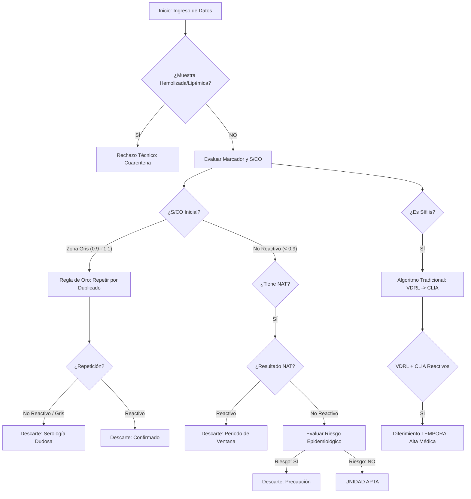

# 💉 Sistema Experto Híbrido: Seguridad Transfusional (ITT)

**Asignatura:** Sistemas Inteligentes

**Carrera:** Ingeniería en Sistemas de Información

**Integrantes:** Martin Carbajal, Santiago Borda, Felix Toledo.

## 📝 Descripción del Proyecto

Este sistema experto está diseñado para automatizar y estandarizar la toma de decisiones en un Laboratorio de Serología de Banco de Sangre. El objetivo es evaluar la aptitud de las unidades de sangre recolectadas basándose en el tamizaje de **Infecciones Transmisibles por Transfusión (ITT)**.

El sistema es **Híbrido**, combinando:

1. **Lógica Difusa (Fuzzy Logic):** Para manejar la incertidumbre de los valores analíticos S/CO (Signal/Cut-off).
2. **Sistemas Basados en Reglas:** Para aplicar protocolos clínicos determinísticos (Algoritmos de Sífilis, NAT, Factores de Riesgo).

---

## 🏗️ Arquitectura del Sistema

El proyecto sigue una estructura modular para separar el conocimiento experto del motor de inferencia:

* `main.py`: Punto de entrada. Interfaz de usuario por consola y manejo de parámetros/archivos.
* `expert_system.py`: Controlador central. Orquesta el flujo de datos y gestiona el **Subsistema de Explicación**.
* `knowledge_base.py`: Contiene las 20 reglas de negocio extraídas del experto humano.
* `inference_engine.py`: Motor de inferencia (Encadenamiento hacia adelante) que evalúa las premisas.
* `fuzzy_engine.py`: Motor difuso que clasifica los valores S/CO y calcula el nivel de certeza.
* `test_cases.py`: Script de validación con los 6 casos de prueba obligatorios.

---

## 🧠 Lógica de Decisión (Flujograma)



---

## 🛠️ Reglas de Negocio Estrictas

Para la implementación, Copilot y el equipo deben respetar estas definiciones:

1. **Etiquetas SCO:** Solo usar `No Reactivo`, `Zona Gris` y `Reactivo`.
2. **Rangos de Zona Gris:** Estrictamente entre **0.9 y 1.1**.
3. **Regla de Oro de Zona Gris:** Si la muestra inicial es "Zona Gris", la unidad **siempre se descarta** (Serología Dudosa), incluso si la repetición da "No Reactivo".
4. **Protocolo de Sífilis/Brucelosis:** Son excepciones al diferimiento permanente. Si son reactivos, el donante es **Diferido Temporal** hasta presentar alta médica.
5. **Condicional NAT:** El NAT (Prueba de Ácidos Nucleicos) solo se evalúa para **HIV, HBV y HCV**. Para los demás, se ignora.

---

## 🚀 Instalación y Ejecución

1. **Clonar el repositorio:**
```bash
git clone [url-del-repo]
cd se-infecciones-itt

```


2. **Instalar dependencias (opcional si se usa skfuzzy):**
```bash
pip install -r requirements.txt

```


3. **Ejecutar el sistema:**
```bash
python main.py

```

---

## 🧪 Casos de Prueba (Validación)

El sistema ha sido validado con los siguientes escenarios mínimos:

| Caso | Entrada (S/CO, NAT, Riesgo, Marcador) | Resultado Esperado | Regla Activada |
| --- | --- | --- | --- |
| 1 | 0.2, NR, No, HIV | **Apta** | R1 |
| 2 | 0.5, Reactivo, No, HCV | **Descarte (Ventana)** | R4 |
| 3 | 1.0, NR, No, HBV | **Descarte (Dudosa)** | R3 (Regla de Oro) |
| 4 | VDRL: R, CLIA: R, Sífilis | **Diferido Temporal** | R10 |
| 5 | 0.1, NR, SÍ, Chagas | **Descarte (Riesgo)** | R6 |
| 6 | Hemolizada | **Cuarentena (Técnico)** | R20 |

---

## 📖 Subsistema de Explicación

El sistema incluye un módulo de trazabilidad que permite al usuario preguntar **"¿Por qué?"**.
Al finalizar cada evaluación, el motor imprime la secuencia de reglas disparadas y la justificación científica basada en el manual de procedimientos de hemoterapia.

---