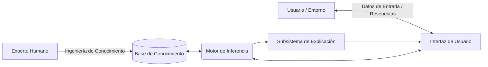

---

# 📚 Teoría de Sistemas Inteligentes (Resumen y Guía para Copilot)

Este documento contiene la base teórica de la asignatura **Sistemas Inteligentes** (Ingeniería en Sistemas de Información), basada en la bibliografía de la cátedra (incluyendo a Russell & Norvig) y los apuntes de clase. Sirve como marco de referencia metodológico para el desarrollo de nuestro Sistema Experto.

La materia se organiza en cuatro ejes temáticos principales:

---

## Eje 1: Fundamentos de IA y Sistemas Inteligentes 🤖

La Inteligencia Artificial, según el enfoque de Russell & Norvig, se centra en el diseño de **Agentes Racionales**: sistemas que perciben su entorno y actúan de manera que maximicen sus posibilidades de éxito.

### Sistemas Expertos (SE)
Un Sistema Experto es un programa informático diseñado para simular la capacidad de toma de decisiones de un experto humano en un dominio específico (en nuestro caso, un bioquímico o especialista en hemoterapia). 

A diferencia de la programación tradicional (donde el programador escribe el flujo de control paso a paso), en un SE se separa el conocimiento de la lógica de procesamiento.

**Arquitectura Clásica de un Sistema Experto:**

* **Base de Conocimiento (Knowledge Base):** Almacena reglas (heurísticas) y hechos. Ej: *Si el donante tiene Riesgo, entonces se descarta la unidad*.
* **Motor de Inferencia (Inference Engine):** El "cerebro". Aplica las reglas a los datos para deducir nueva información.
* **Subsistema de Explicación:** Permite al sistema justificar sus decisiones (responder al "¿Por qué?"). Es crucial en dominios médicos o legales para generar confianza.

### Tipos de Sistemas Expertos

1. **Basados en Reglas (Determinísticos):** Usan lógica clásica booleana (Verdadero/Falso).
2. **Probabilísticos:** Manejan la incertidumbre usando Teorema de Bayes o Redes Bayesianas.
3. **Lógica Difusa (Fuzzy Logic):** Maneja grados de verdad. En lugar de blanco o negro, permite tonos de gris.
* *Analogía:* En lugar de decir "el agua está caliente o fría", dice "el agua está un 70% caliente". En nuestro dominio, lo usamos para el valor analítico de S/CO (Zona gris).

---

## Eje 2: Búsqueda (Resolución de Problemas) 🔍

Cuando un agente no sabe exactamente cómo llegar a la solución, debe "buscarla" explorando diferentes estados.

* **Búsqueda No Informada (Ciega):** El algoritmo explora el espacio de soluciones sin información adicional. (Ej: Búsqueda a lo ancho - BFS, Búsqueda en profundidad - DFS).
* **Búsqueda Informada (Heurística):** Utiliza "pistas" o estimaciones (heurísticas) para encontrar la solución más rápido. (Ej: Algoritmo A*).
* *Analogía:* Si buscas un tesoro, la búsqueda ciega es cavar en cada metro cuadrado de la isla. La búsqueda informada es tener un detector de metales (la heurística) que te dice si estás "más caliente" o "más frío".

* **Algoritmos Genéticos:** Inspirados en la evolución biológica (selección natural, mutación, cruce). Se usan para problemas de optimización muy complejos donde el espacio de búsqueda es inmenso.

---

## Eje 3: Aprendizaje (Machine Learning) 🧠

El aprendizaje automático permite a los sistemas mejorar su rendimiento a partir de la experiencia (datos) sin ser programados explícitamente para cada escenario.

* **Aprendizaje Supervisado:** El sistema aprende de un conjunto de datos etiquetados (con respuestas conocidas). Ej: Redes Neuronales que aprenden a clasificar imágenes de gatos y perros porque se les mostraron miles de ejemplos previamente clasificados.
* **Aprendizaje No Supervisado:** El sistema busca patrones ocultos en datos no etiquetados (Ej: agrupar clientes por comportamiento de compra).
* **Redes Neuronales Artificiales:** Modelos matemáticos inspirados en el cerebro humano, con capas de "neuronas" interconectadas. Ideales para reconocimiento de patrones complejos.

---

## Eje 4: Aplicaciones de la IA y Nuestro Proyecto 🚀

La IA se aplica en Procesamiento de Lenguaje Natural, Visión por Computadora, Robótica y, nuestro enfoque: **Sistemas de Soporte a la Decisión Clínica (CDSS)**.

### ¿Cómo aplica esta teoría a nuestro código? (Guía para Copilot)

Nuestro proyecto de **Seguridad Transfusional (ITT)** implementa conceptos del Eje 1, construyendo un **Sistema Experto Híbrido**:

1. **Estrategia de Inferencia - Encadenamiento hacia Adelante (Forward Chaining):** * *Concepto:* Partimos de los datos (Ej: `S/CO = 0.5`, `NAT = No Reactivo`) y aplicamos las reglas para llegar a una conclusión (`Unidad = Apta`). Es un razonamiento guiado por los datos (*Data-driven*).
* *Implementación:* Nuestro `inference_engine.py` iterará sobre la Base de Conocimientos buscando qué condiciones (premisas) hacen *match* con los datos de entrada del paciente.

2. **Lógica Difusa (Fuzzificación):** * *Concepto:* En lugar de usar un umbral rígido que podría ser peligroso, mapeamos un valor numérico continuo (el S/CO de 0.00 a 50.00) a variables lingüísticas (`No Reactivo`, `Zona gris`, `Reactivo`) asignando un nivel de certeza.
* *Implementación:* Nuestro `fuzzy_engine.py` calcula el nivel de pertenencia de los datos del laboratorio a estas etiquetas, priorizando la precaución máxima (100% de duda) en la Zona gris (0.9 a 1.1).

3. **Heurísticas del Dominio:** Nuestras reglas (como el descarte inmediato por *Zona gris Inicial* o el algoritmo *VDRL->CLIA* para Sífilis) son conocimientos capturados de expertos humanos reales (Ingeniería de Conocimiento).
